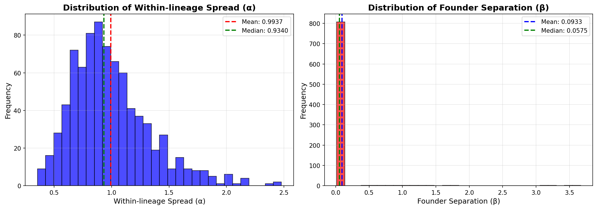

# Spatial Mapping Summary Report

**Generated:** 2025-11-03 01:26:58

## Overview

- **Total trees processed:** 825
- **Successful mappings:** 825 (100.0%)
- **Errors:** 0

## Spatial Metrics Statistics

- **Average Moran's I:** 0.7627 ± 0.2305
- **Average within-lineage spread (α):** 0.9937 ± 0.3427
- **Average founder separation (β):** 0.0933 ± 0.2866
- **Average β/α ratio:** 0.0951 ± 0.2305

## Distribution Statistics

### Within-lineage Spread (α)

- **Mean:** 0.9937
- **Median:** 0.9340
- **Standard Deviation:** 0.3427
- **Min:** 0.3557
- **Max:** 2.4777
- **25th Percentile:** 0.7508
- **75th Percentile:** 1.1666

### Founder Separation (β)

- **Mean:** 0.0933
- **Median:** 0.0575
- **Standard Deviation:** 0.2866
- **Min:** 0.0151
- **Max:** 3.6664
- **25th Percentile:** 0.0482
- **75th Percentile:** 0.0674

## Distribution Plots

*Figure: Distribution of within-lineage spread (α) and founder separation (β) across all trees.*

